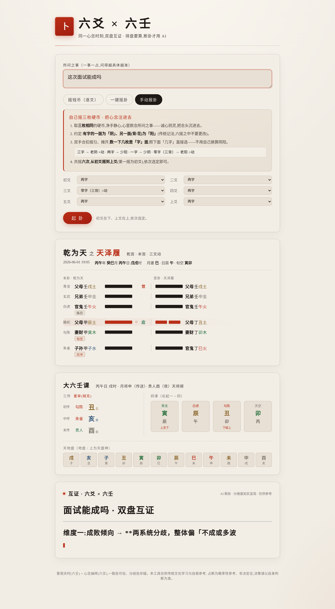

# 六爻 × 六壬 · Liu Yao × Da Liu Ren

**[English](README.en.md) | [中文](README.md)**

AI 辅助的**六爻(纳甲)+ 大六壬**占卜工具:**同一心念时刻,双盘互证**,用来测**具体的事**(求财、问事、测病、寻物、问婚……)。

- **六壬 = 当下客观天时盘**:此刻的事态本身(同一刻谁起都同一课)。
- **六爻 = 你的心念抽样**:你与这件事的关系(摇出的卦因人而异)。
- **互证 = 客观场 ∩ 个人投射**:两盘同源同时,一致处可信、分歧处存疑。



## 核心设计原则

> **排盘要"算",断卦才"用 AI"。**

- **起卦 / 起课是确定性计算**:六爻摇卦→本卦/变卦/京房世应/纳甲/六亲六神/伏神;六壬→月将/天地盘/四课/三传/十二天将。有唯一正确答案,绝不交给 LLM。
- **AI 只做断卦层**:拿到两副**已排定、带全部标注**的盘,按各自规矩取用,分维度互证。

## 功能

- 🎲 **三种起卦**:电子摇钱币(逐爻,开始/停)、一键摇卦、手动报卦
- 🧮 **六爻装卦**:本卦/变卦、卦宫、世应、纳甲(干支+五行)、六亲、六神、伏神、占时(月建/日辰/旬空)
- 🪙 **大六壬起课**:月将(中气定太阳过宫)、天地盘、四课、三传(九宗门)、十二天将
- 🔮 **四维度互证**:成败倾向 / 应期 / 人物方位 / 风险性质,逐维**如实标一致或分歧**(不给伪精确百分比)
- 🆓 **默认免费免 key**:AI 默认走 pollinations,可切 GLM / 本地 Ollama / Claude
- 🖥️ Web 界面(双盘 + 互证)与 CLI 两套

## 准确性 · 交叉验证

排盘绝不靠 LLM。六壬起课对**开源 [kinliuren](https://github.com/kentang2017/kinliuren)** 做了 384 例自动差分,并对**古籍课例**校验:

- **月将 / 四课 / 天乙贵人**:384/384 一致
- **三传取用**(重审/元首/比用/遥克/**涉害**/昴星/反吟):锚定**古籍定本**(如涉害「甲辰日戌加寅→子,子5重>戌4重」有回归测试);仅伏吟自刑边界流派或异,已注记
- 24 项测试全过

## 快速开始

### Web 界面(推荐)

```bash
npm install
npm run build                 # 先构建排盘引擎(web 依赖它)
npm run dev -w @liuyao/web     # 打开 http://localhost:3030
```

输入所问 → 摇卦/手动报卦 → 六爻卦盘 + 六壬课盘 → AI 四维度互证(流式)。

### 命令行(双盘互证,与 Web 一致)

```bash
npm install && npm run build
node bin/liuyao.mjs "这次面试能成吗"            # 摇卦 + 同刻起课 + 四维度互证
node bin/liuyao.mjs "测病" --provider ollama     # 本地 ollama(质量好)
node bin/liuyao.mjs "丢钱包能找回吗" --lines 6,7,8,9,7,8  # 手动报六爻(初→上)
node bin/liuyao.mjs "测事" --no-ai                # 只排双盘,不互证
```

### 测试

```bash
npm test
```

## AI provider(断卦层)

排盘不花钱、不需要 key。只有 AI 断卦/互证走 provider,在 `.env` 用 `AI_PROVIDER` 选一家:

| provider | 费用 | 需要 key | 说明 |
|----------|------|---------|------|
| `pollinations`(默认) | 免费 | 否 | 开箱即用、在线小模型;**长断常吐空,只够"先跑通",真断请换 ollama/glm** |
| `ollama` | 免费 | 否 | 本地、不联网;需装 [Ollama](https://ollama.com/) + `ollama pull qwen2.5:32b` |
| `glm` | 免费 | 是 | 中文强,推荐:[open.bigmodel.cn](https://open.bigmodel.cn/) |
| `gemini` / `groq` | 免费 | 是 | 见 `.env.example` |
| `anthropic` | 付费 | 是 | 质量最高 |
| `custom` | — | 看情况 | 任意 OpenAI 兼容端点 |

## 项目结构

```
src/
  trigrams/hexagrams/wuxing/cast/date/najia/render.ts   六爻引擎(京房世应 + 纳甲装卦)
  liuren/
    core.ts        月将 / 天地盘 / 四课
    sanchuan.ts    三传(九宗门:贼克/比用/涉害/遥克/昴星/别责/八专/伏吟/反吟)
    tianjiang.ts   十二天将(天乙贵人 + 昼夜 + 顺逆布)
    index/render.ts
  moment.ts        castMoment():同一时刻双盘同源
  ai/
    interpret.ts   六爻断卦
    cross.ts       六爻 × 六壬 四维度互证
    provider.ts    多 provider(pollinations/ollama/glm/gemini/groq/anthropic/custom)
bin/liuyao.mjs     CLI
apps/web/          Next.js 14(水墨/朱砂):/api/cast 双盘、/api/cross 流式互证
```

## 互证规则(AI 遵循)

1. **先各自取用,再比结论**,不把两套术语硬翻译(六爻用神 ≠ 六壬类神)。
2. **不给单一可信度百分比**——两盘共享日辰月建、非完全独立,"一致"的证据力比直觉弱。
3. **分维度报一致/分歧**:成败、应期、人物方位(六壬强)、风险性质(六壬天将强)。
4. **落到行动**:不停在吉凶,给"该怎么做"。

## 免责声明

本工具仅供**传统文化学习与自我参考**。占断为**概率性参考,非决定论**,不构成任何专业建议,决策请以自身判断为准。

## License

MIT
